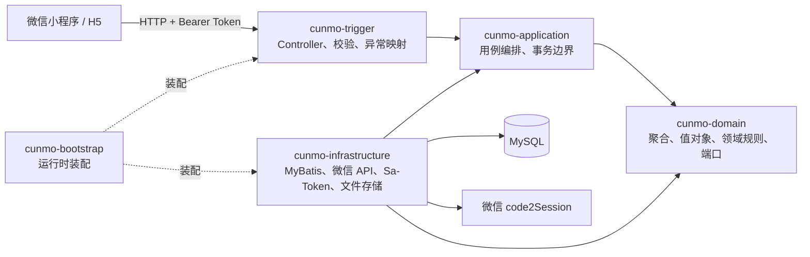

# 存魔（存量魔方）

存魔是一个面向个人物品与库存管理的微信小程序。用户可以按“魔方域 → 空间 → 分类 → 物品”组织物品，完成入库、库存调整、低库存提醒、统计分析、流转追踪，以及空间和分类删除时的批量迁移。

当前仓库同时包含：

- 基于 uni-app、Vue 3、TypeScript 和 Pinia 的微信小程序/H5 前端。
- 基于 Java 21、Spring Boot、MyBatis-Plus、Sa-Token 和 MySQL 的后端。
- 用户、RBAC、库存领域和删除迁移能力的数据库脚本。

> 当前状态：核心业务链路已经落地，适合作为功能开发与架构演进基础；权限执行、部署、迁移治理和生产级可观测性仍需继续建设。

## 当前能力

- 首页默认以游客示例数据提供浏览体验，不在启动时强制授权。
- 用户执行资料页、创建、库存调整或删除等受保护操作时再触发微信登录。
- 登录成功后加载真实库存并恢复安全的待办操作；退出后仅注销当前 Token，并返回游客体验。
- 微信 `wx.login` 登录，服务端通过 `code2Session` 换取微信身份。
- 首次登录自动创建系统用户并绑定默认 `USER` 角色。
- 用户昵称更新和头像上传。
- 每个用户自动创建独立库存魔方域。
- 空间、分类及空间分类绑定管理。
- 物品创建、库存增减和低库存预警。
- 按空间、分类、关键词查询物品。
- 空间/分类维度的库存统计和游标分页。
- 不可变库存流水与位置快照。
- 物品、空间和分类的删除影响预览。
- 删除结构时选择批量迁移或清零删除，并在事务中写入流水。
- 容量与配额看板，以及 FREE 用户 3 个根空间、每空间 3 个分类、
  每腔体 10 条物品记录的服务端强制限制。
- 9.9 元月度 PRO、69 元永久 PRO、手动续费和到期自动降级。
- 微信 JSAPI 支付、普通商户委托代扣签约/扣款/解约，以及重复回调幂等。
- 联系管理员升级、企业微信二维码、电话和微信客服入口。
- 管理员升级申请审批 API；本期不包含管理端可视化页面。

## 会员与容量配额

### 套餐与权益

| 套餐 | 产品编码 | 价格 | 有效期 | 库存配额 |
| --- | --- | ---: | --- | --- |
| FREE | `FREE` | 免费 | 长期 | 3 个根空间、每空间 3 个分类、每腔体 10 条物品记录 |
| 月度 PRO | `MONTHLY_PRO` | 9.9 元 | 每次 30 天 | 根空间、分类和腔体物品记录不限量 |
| 永久 PRO | `LIFETIME_PRO` | 69 元 | 永久 | 根空间、分类和腔体物品记录不限量 |

套餐价格和支付金额以服务端产品定义为准，前端只负责展示和提交产品编码。
FREE 配额由服务端在库存写事务中强制校验，不能通过绕过小程序页面突破限制。

已有数据在会员到期后不会被删除。用户仍可查询、扣减库存和删除数据，但在数据
回落至 FREE 配额前不能继续创建超额结构或物品。

### 购买、续费与到期

- 月卡首次购买或过期后续费：从支付成功时间增加 30 天。
- 月卡未过期时续费：从当前到期时间继续增加 30 天。
- 自动续费：使用微信普通商户委托代扣，支持签约、扣款、失败重试和解约。
- 到期处理：接口读取时立即按 FREE 权益处理，定时任务再批量收敛数据库状态。
- 永久会员：权益永久有效，并终止或停止后续自动扣款。
- 支付结果：以前端轮询到的服务端订单状态为准，不直接信任
  `uni.requestPayment` 的成功回调。

主动 JSAPI 支付使用微信支付 API v3；普通商户委托代扣使用 V2 XML 与
`HMAC-SHA256`。支付、签约和扣款通知均校验 AppID、商户号、金额及本地业务状态，
并通过通知记录与订单状态实现幂等。

自动续费依赖商户已开通委托代扣能力。配置不完整时，看板返回
`renewal.supported = false` 并隐藏自动续费入口，但 9.9 元月卡仍可手动购买和续费。

### 用户端与管理员接口

用户端：

```text
GET  /api/membership/dashboard
POST /api/membership/orders
GET  /api/membership/orders/{orderNo}
POST /api/membership/renewal-agreements
POST /api/membership/renewal-agreements/terminate
POST /api/membership/upgrade-requests
```

微信支付回调：

```text
POST /api/wechat-pay/payment-notify
POST /api/wechat-pay/contract-notify
POST /api/wechat-pay/renewal-notify
```

管理员升级申请 API：

```text
GET  /api/admin/membership/upgrade-requests
POST /api/admin/membership/upgrade-requests/{id}/approve
POST /api/admin/membership/upgrade-requests/{id}/reject
```

管理员接口要求 `membership:upgrade:review` 权限，可授予自定义月数或永久会员。
当前只提供管理员 API，不包含管理端可视化页面。用户可在容量看板提交升级申请，
也可通过已配置的微信客服、企业微信二维码或电话联系管理员。

### 数据库与配置

会员功能由 `backend/mysql/006_membership_quota.sql` 提供数据结构，包括：

- `membership_entitlement`：当前会员权益。
- `membership_order`：月卡和永久会员订单。
- `membership_renewal_agreement`：自动续费协议。
- `membership_renewal_attempt`：代扣尝试与失败记录。
- `membership_upgrade_request`：联系管理员升级申请。
- `membership_payment_notification`：支付与签约通知幂等记录。

基础支付至少需要配置商户号、商户证书、API v3 密钥和支付通知地址。自动续费还需
配置 API v2 密钥、签约计划、签约/扣款通知地址、服务端公网出口 IP，以及商户实际
获批产品对应的扣款和解约 URL。完整变量见
[`backend/java/.env.example`](backend/java/.env.example)。

## 技术栈

| 区域 | 技术 |
| --- | --- |
| 小程序前端 | uni-app、Vue 3、TypeScript、Pinia |
| 样式 | Tailwind CSS、weapp-tailwindcss |
| 前端构建与测试 | Vite、vue-tsc、Vitest |
| Java | Java 21、Spring Boot 3.4.5、Maven |
| 持久化 | MyBatis-Plus 3.5.9、MySQL 8.0+ |
| 登录态 | Sa-Token 1.39.0 |
| 外部调用 | Spring WebClient |

## 项目结构

```text
.
├── src/                        # uni-app 前端源码
│   ├── components/             # 页面组件
│   ├── pages/                  # 小程序页面
│   ├── services/               # HTTP、登录、库存、会员和支付编排
│   ├── stores/                 # Pinia 状态
│   └── types/                  # TypeScript 类型
├── backend/
│   ├── java/                   # Java 多模块后端
│   ├── mysql/                  # 数据库结构、种子和迁移脚本
│   └── README.md               # 后端接口与安全细节
├── docs/superpowers/specs/     # 已确认的设计文档
├── docs/superpowers/plans/     # 对应实施计划
├── scripts/                    # 小程序构建补丁脚本
├── package.json
└── project.config.json         # 微信开发者工具项目配置
```

## 快速启动

### 1. 前置环境

- Node.js 20+ 和 npm。
- 微信开发者工具。
- JDK 21。
- Maven 3.9+。
- MySQL 8.0+。

### 2. 初始化数据库

先创建数据库和开发账号，例如：

```sql
CREATE DATABASE cunmo
  CHARACTER SET utf8mb4
  COLLATE utf8mb4_0900_ai_ci;
```

按顺序执行：

```text
backend/mysql/001_wechat_users.sql
backend/mysql/002_rbac_seed.sql
backend/mysql/003_inventory_domain.sql
backend/mysql/005_inventory_deletion.sql
backend/mysql/006_membership_quota.sql
```

`004_inventory_seed.sql` 仅用于本地联调。使用它之前，必须先登录并调用一次 `GET /api/inventory/bootstrap`，让系统创建当前用户的默认魔方域。

当前脚本需要人工按顺序执行。`005_inventory_deletion.sql` 是非幂等
`ALTER TABLE`，不要对同一数据库重复执行。`006_membership_quota.sql`
创建会员、订单、自动续费与升级申请表，并将免费版腔体容量统一为 10。

### 3. 启动 Java 后端

复制后端环境变量示例：

```bash
cp backend/java/.env.example backend/java/.env
```

编辑 `backend/java/.env`，至少配置：

```dotenv
WECHAT_APP_ID=<微信小程序AppID>
WECHAT_APP_SECRET=<微信小程序AppSecret>
DATABASE_URL=jdbc:mysql://127.0.0.1:3306/cunmo?useUnicode=true&characterEncoding=utf8&serverTimezone=Asia/Shanghai
DATABASE_USERNAME=<数据库用户名>
DATABASE_PASSWORD=<数据库密码>
TOKEN_TTL_SECONDS=7200
SERVER_PORT=8080
AVATAR_STORAGE_DIRECTORY=./data/uploads/avatars
```

会员支付和联系方式配置见
[`backend/java/.env.example`](backend/java/.env.example)。未完整配置普通商户
委托代扣参数时，后端会返回 `renewal.supported = false`，小程序仍支持月卡手动续费。

构建并启动：

```bash
cd backend/java
mvn clean install
mvn -pl cunmo-bootstrap spring-boot:run
```

后端默认监听 `http://127.0.0.1:8080`。

### 4. 启动前端

在仓库根目录执行：

```bash
cp .env.example .env
npm install
npm run dev:mp-weixin
```

构建结果由 uni-app 输出到 `dist/build/mp-weixin` 或开发模式对应目录，再使用微信开发者工具打开项目。

H5 调试：

```bash
npm run dev
```

前端通过 `VITE_API_BASE_URL` 访问后端，默认值为：

```dotenv
VITE_API_BASE_URL=http://127.0.0.1:8080
```

浏览器 H5 与后端端口不同，当前后端尚未提供 CORS 配置；完整登录和接口联调优先使用微信开发者工具，或在本地开发环境补充代理/CORS 配置。

微信小程序构建会把 `VITE_API_BASE_URL` 编译进 `dist`。本地开发与生产上传必须明确使用不同地址：

```bash
# 本地开发者工具
rm -rf dist/build/mp-weixin
VITE_API_BASE_URL=http://127.0.0.1:8080 npm run build:mp-weixin

# 正式上传
rm -rf dist/build/mp-weixin
VITE_API_BASE_URL=https://cunmo.icu npm run build:mp-weixin
```

电脑上的开发者工具可以访问 `127.0.0.1`；手机真机不能把该地址当作开发电脑，真机联调需使用电脑局域网地址或 HTTPS 测试域名。上传前可检查实际产物：

```bash
rg 'cunmo\.icu|127\.0\.0\.1|localhost' dist/build/mp-weixin
```

## 常用命令

前端：

```bash
npm test                 # 运行 Vitest
npm run build            # 类型检查并构建 H5
npm run build:mp-weixin  # 类型检查并构建微信小程序
```

后端：

```bash
cd backend/java
mvn test
mvn clean package
```

## 系统调用链



典型库存写入流程：

```text
Controller
  → 读取当前登录用户
  → Application Service 开启事务并定位用户 vault
  → Domain 校验库存、容量或删除策略
  → Repository Port
  → MyBatis Repository 实现
  → MySQL 更新主数据并写入库存流水
```

查询流程不重建完整聚合，而是由 `InventoryQueryService` 通过查询 Mapper 直接组装页面所需结果。这是一种轻量的读写模型分离。

## Java 模块职责

```text
backend/java
├── cunmo-api             # HTTP 请求/响应契约和参数校验注解
├── cunmo-domain          # 业务模型、领域规则、仓储与网关端口
├── cunmo-application     # 应用用例、事务、命令、结果和应用端口
├── cunmo-infrastructure  # MySQL、微信、Sa-Token、头像存储实现
├── cunmo-trigger         # Controller、Converter、Filter、异常处理
└── cunmo-bootstrap       # 唯一可执行模块和运行配置
```

Maven 依赖方向：

```text
cunmo-trigger ───────→ cunmo-api
      │
      └──────────────→ cunmo-application ───→ cunmo-domain
                                      ↑             ↑
                         cunmo-infrastructure ───────┘

cunmo-bootstrap 负责聚合 trigger 与 infrastructure
```

`cunmo-domain` 不依赖 Spring、MyBatis、Sa-Token 或微信 HTTP DTO，业务规则可以脱离框架进行单元测试。

## 为什么这样设计

### 1. 为什么使用 DDD 模块化单体

当前系统只有一个主要业务域和一套数据库，直接拆微服务会先引入服务发现、分布式事务、链路追踪和部署编排成本，却没有足够的团队规模或流量收益。

模块化单体保留单进程、单事务和简单部署，同时用 Maven 模块限制依赖方向。这样做的目的不是“类越多越好”，而是让登录、库存规则、HTTP 协议和基础设施可以分别变化。

代价是当前项目规模下文件和转换层显得较多，因此只有包含真实业务规则的边界才值得保留，不能继续为了形式增加空壳层。

### 2. 为什么领域层不依赖框架

库存不能为负、容量限制、用户禁用、删除迁移策略等规则属于业务，而不是 Spring 或 MyBatis 的行为。

把这些规则放在聚合和值对象中，可以：

- 不启动 Spring 即可测试核心规则。
- 替换数据库或登录组件时不重写业务模型。
- 避免 Controller、Mapper 各自实现一套不一致的校验。

### 3. 为什么写模型和查询模型分开

写操作需要聚合、锁、乐观版本和事务保证一致性；页面查询更关注筛选、聚合、分页和展示结构。如果所有查询都先恢复完整聚合，会产生不必要的对象组装和多次数据库访问。

因此当前设计让写操作经过领域模型，查询通过 `InventoryQueryService` 返回应用结果。这不是完整 CQRS，也没有引入消息队列或双数据库，只是对读写职责做最低成本的分离。

### 4. 为什么用 `vault_id` 隔离库存

首版每个用户拥有一个魔方域，所有库存表都带 `vault_id`。服务端先由当前用户定位魔方域，再把 `vault_id` 带入查询和修改条件。

这样既能阻止用户访问其他人的数据，也为未来“家庭成员共享同一个魔方域”保留空间：届时可以增加成员关系，而不需要重写全部库存表。

### 5. 为什么数据库没有外键

当前设计用索引、应用事务和领域校验维护关联有效性，没有创建数据库外键。主要原因是为逻辑删除、历史归档、批量迁移以及未来分库保留灵活性。

这是一项有成本的选择：应用代码和测试必须承担更多一致性责任。若团队无法持续维护事务校验和数据巡检，数据库外键会是更稳妥的默认方案。当前设计成立的前提，是关键写操作始终经过应用服务。

### 6. 为什么使用逻辑删除和流水快照

空间、分类和物品使用逻辑删除，库存流水保持不可变。删除或迁移时，流水保存来源与目标位置快照。

原因是名称和位置会变化，只保存外部主键无法解释历史发生了什么；物理级联删除又会破坏审计链路。快照让历史记录不依赖当前主数据是否仍然存在。

### 7. 为什么使用 Sa-Token 和端口适配

应用层只依赖 `TokenService`、`CurrentUserProvider`，Sa-Token 实现位于基础设施层。这样登录用例不需要了解 Token 库的静态 API，也便于测试时替换实现。

Sa-Token 降低了微信小程序业务登录态的实现成本，但它只解决登录态管理，不会自动完成项目的 RBAC 权限执行。配置使用 `is-concurrent: true` 和 `is-share: false`，允许同一用户多设备登录，同时为每次登录签发独立 Token，使退出仅影响当前设备。

认证链路通过 Micrometer 记录登录与退出的成功数、失败错误码和总耗时。Spring Boot Actuator 暴露 `/actuator/health`、`/actuator/info`、`/actuator/metrics` 与 `/actuator/prometheus`。生产部署必须在网关或网络层限制 `/actuator` 的访问来源，不应直接暴露到公网。

Micrometer 在应用内只保存计数器和计时器的聚合状态，不保存每次请求明细，内存占用不会随请求次数线性增长。指标标签必须保持低基数，禁止使用用户 ID、Token、openid、traceId 或异常消息。应用重启后内存指标会清零；长期趋势由 Prometheus 定时抓取 `/actuator/prometheus` 并持久化。

### 8. 为什么在应用层控制事务

一次用例可能同时修改聚合、关系表和库存流水。事务放在应用服务，能够覆盖完整业务动作，例如“迁移全部物品、补充目标绑定、删除来源结构、写入流水”。

领域对象只负责做决定，不负责开启数据库事务；Repository 实现只负责持久化，不决定一个用例应包含哪些步骤。

## Java 现阶段存在的问题

下面列出的不是 Java 语言本身的问题，而是当前 Java 后端实现仍未完成或需要收敛的部分。

| 现状 | 形成原因 | 影响 | 建议 |
| --- | --- | --- | --- |
| RBAC 表、角色和权限快照已经存在，但普通库存 Controller 尚未普遍执行权限码校验；管理员会员接口已校验 `membership:upgrade:review` | 第一阶段优先打通微信登录和库存数据隔离，随后只为管理员会员审批补充了权限执行 | 普通登录用户原则上仍可调用全部普通库存业务接口 | 将管理员接口使用的权限端口扩展到其他敏感接口，并补权限拒绝测试 |
| Sa-Token 登录态使用当前默认存储，未接入 Redis | 当前运行目标是单实例本地开发 | 多实例部署时登录态不能可靠共享，重启后的会话行为也依赖本地实现 | 上线多实例前接入 Redis，并明确并发登录和续期策略 |
| 头像保存在本地目录 | 先满足微信头像上传的最小闭环，并通过 `AvatarStorage` 预留了端口 | 容器重建、多实例和 CDN 场景下文件不可共享 | 用对象存储实现替换 `LocalAvatarStorage`，保留应用端口不变 |
| 数据库变更由编号 SQL 人工执行，`005` 不是幂等脚本 | 项目仍处于快速建模阶段，尚未引入迁移工具 | 环境容易漏执行、重复执行或出现结构漂移 | 引入 Flyway 或 Liquibase，把已有脚本纳入版本基线 |
| `cunmo-infrastructure` 直接依赖 `ApplicationException` 和应用查询结果类型 | 为快速统一错误协议并减少查询 DTO 转换，基础设施依赖了应用层 | 异常语义和查询数据结构耦合，后续替换持久化或拆模块更困难 | 将持久化错误转换放回应用层；为查询端口定义稳定投影类型 |
| `InventoryRepositoryImpl`、`InventoryDeletionRepositoryImpl` 和 `InventoryController` 文件较大 | 库存新增、查询、流水、删除和迁移在短期内集中增长 | 修改时认知负担高，测试和代码评审难以聚焦 | 按物品、结构、删除迁移和查询职责拆分仓储与 HTTP 入口，但保持同一领域事务 |
| 测试覆盖不均，数据库写入、权限执行和完整删除事务缺少集成测试；当前读模型测试文件还被整体注释 | 现阶段以用例单测和少量契约测试为主，复杂 MyBatis 场景尚未建立稳定测试库 | SQL、锁、逻辑删除和回滚问题可能只在联调时出现 | 恢复被注释测试，引入 Testcontainers MySQL，覆盖迁移、并发、回滚和跨用户隔离 |
| 微信登录注册流程没有一个清晰覆盖“注册、默认角色、登录时间”的整体事务边界 | 微信网络调用被有意放在事务外，但数据库阶段尚未单独封装事务用例 | 中途数据库失败时可能留下部分状态，具体风险取决于仓储内部实现 | 保留外部 HTTP 调用在事务外，把身份落库到授权加载之间收敛成独立事务服务 |
| 错误码映射集中在一个静态 Map 中，部分新错误依赖默认 `400` | 功能快速增加时优先保持统一响应格式 | 错误码和 HTTP 状态可能遗漏，客户端难以区分冲突、未找到和参数错误 | 按领域维护错误定义或让异常携带受控 HTTP 语义，并增加映射完整性测试 |
| 已增加 Actuator 健康检查和认证指标，但仍缺少 OpenAPI 和标准部署描述 | 当前重点仍是功能闭环和本地联调 | 接口协作和自动部署成本仍然较高 | 在部署前补 OpenAPI、容器镜像和环境配置规范，并在网关限制 Actuator 访问 |
| H5 跨域开发支持尚未配置 | 主要交付目标是微信小程序 | 浏览器本地联调会被 CORS 限制 | 增加仅开发环境启用的 Vite 代理或后端受控 CORS 白名单 |

## 建议演进顺序

1. 先建立 Flyway/Liquibase 和 Testcontainers MySQL，保证数据库变更可重复验证。
2. 补跨用户隔离、库存并发、删除迁移回滚和登录注册事务集成测试。
3. 让 RBAC 权限真正作用于接口，而不只是登录响应中的展示数据。
4. 将 Sa-Token 会话和头像文件迁移到共享基础设施。
5. 拆分库存大类，并收敛基础设施对应用异常和结果类型的依赖。
6. 最后补齐 Actuator、OpenAPI、容器化、指标和生产部署说明。

不建议当前立即拆微服务。应先把模块边界、迁移、测试和运维基础做好；只有出现独立扩缩容、独立团队或明确故障隔离需求时，再评估服务拆分。

## 数据与安全边界

- 微信 `appid`、`secret` 只允许存在于后端环境变量。
- 不向前端返回 `openid`、`unionid`、`session_key` 或 AppSecret。
- 当前实现不持久化 `session_key`。
- 日志禁止记录微信 code、完整 Token、openid、session_key 和 secret。
- 认证指标禁止使用用户 ID、Token、openid、traceId 或异常消息作为标签。
- 库存接口必须先由当前登录用户定位 `vault_id`。
- 库存数量更新和流水写入必须位于同一事务。
- 生产环境必须启用 HTTPS。

## 开发约束

- Java 业务包统一使用 `cn.cunmo`。
- 领域层不得依赖 Spring、MyBatis、Sa-Token 或 HTTP DTO。
- Controller 只负责协议适配，不承载库存和授权规则。
- 数据库 DO 不得直接作为 HTTP 响应。
- Java 显式方法和构造函数使用中文 Javadoc 说明职责和边界。
- 前端 Pinia 保存交互状态和服务端结果，不复制服务端业务规则。
- 新增数据库结构时必须提供可追踪迁移和回滚/兼容说明。
- 不在日志、示例文件或提交记录中写入真实密钥。

## 相关文档

- [Java 后端说明](backend/README.md)
- [Java DDD 登录与 RBAC 设计](docs/superpowers/specs/2026-06-05-java-ddd-auth-rbac-design.md)
- [微信登录设计](docs/superpowers/specs/2026-06-05-wechat-auth-design.md)
- [库存领域设计](docs/superpowers/specs/2026-06-06-inventory-domain-design.md)
- [库存删除与迁移设计](docs/superpowers/specs/2026-06-06-inventory-deletion-design.md)
- [延迟登录与游客体验设计](docs/superpowers/specs/2026-06-08-deferred-auth-design.md)
- [认证监控与退出设计](docs/superpowers/specs/2026-06-08-auth-monitoring-logout-design.md)
- [容量配额与会员商业化设计](docs/superpowers/specs/2026-06-10-membership-quota-dashboard-design.md)
- [容量配额与会员实施计划](docs/superpowers/plans/2026-06-10-membership-quota-dashboard.md)

## 项目阶段判断

当前设计适合“单团队、单体部署、业务规则仍在快速演进”的阶段。它已经通过模块和领域模型建立了边界，但尚未具备完整的生产工程能力。

现阶段最重要的不是继续增加架构层次，而是让已有边界经得住数据库迁移、集成测试、权限执行和部署运维的验证。
